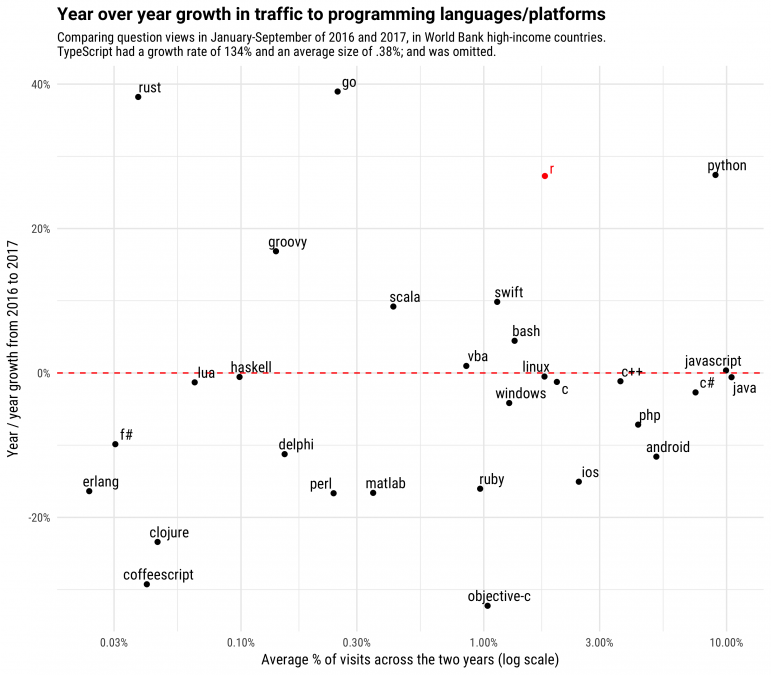

```{r setup, include=FALSE}
knitr::opts_chunk$set(echo = TRUE,
                      collapse = TRUE,
                      comment = "#>",
                      message = FALSE
)
```

# An overview


## What is R

R is an open source programming language that is extremely versatile and rapidly becoming the top choice for data analysis tasks both in academia and in the industry. It is different from ‘point and click’ software (such as SPSS) since you need to write code to tell R what you want it to do. This means a steep learning curve but even on the short run will allow to produce code that is custom made to your specific problem and can be reproduced reliably by you or others.


## Why R?

- One of the most used statistical tools in academia and in industry
- It is open source, which means that the functions are not black boxes; when in doubt you can check what happens under the hood.
- Because it is open source, it is at the cutting-edge of implementing new methods
- The R developer and user community is great in numbers and in resources. If you have a problem, chances are there is a package for that or an online discussion on how to solve it.
- Reproducible research, which means that your code will produce the exact same output, making it easier to replicate your results or verify your (or others’) methods.
- Statistical programming is a great transferable skill to have
- Free of charge

<br>
<br>

**Evidence 1:**

```{r out.width = "600px", echo=FALSE, fig.cap="",fig.align='center'}

```


<br>
<br>

**Evidence 2:**

```{r out.width = "600px", echo=FALSE, fig.cap="", fig.align='center'}
knitr::include_graphics("figures/r_users.png")
```


*Source: [https://stackoverflow.blog/2017/10/10/impressive-growth-r/](Stack Overflow blog)*


# Setting up R and RStudio

> Supplimentary resources: [RStudio IDE Cheat Sheet](https://www.rstudio.com/wp-content/uploads/2016/01/rstudio-IDE-cheatsheet.pdf)  

R comes with a pretty spartan GUI so we will work with the RStudio IDE (integrated development environment). 

The workflow with RStudio consists of using:

1. Scripts for writing code (you should avoid working directly to the console!)
2. Projects, so your work is self-contained.
3. Some miscalleneus setting that *really* helps

Some tips for using RStudio:

* Under `Tools -> Global Options` you can change the following:  

    + `Code -> Editing -> Soft wrap R source files` If you check this, the lines in your script file do not run “out of the window”.
    + `Appearance`: You can select your colour scheme here. If you stare at the screen for a long time, white text against a darker background might be less hard on the eyes.
    + `Pane layout`: Here you can select how the window space in R studio is arranged. It might be useful to keep your source file on the one side and the console on the other side and not on top of each other. (see pic below)  
    

* A few essential keyboard short-cuts (for Windows):

    + Control+Enter: run the code on the current line
    + Control+Alt+B: run the code from the beginning to the current line.
    + Control+Alt+E: run the code from the current line to the end of the source file.
    + Control+D: delete the current line.
    + Alt+Shift+Up/Down: Copy the current line above or below the line.
    + Alt+Control+Up/Down: Copy the current line above or below the line.
    + You can see the full list of keyboard short-cuts in RStudio, if you press **Alt+Shift+K**


```{r out.width = "600px", echo=FALSE, fig.align='center'}

```

## Using Projects

Using Projcets with RStudio will simplify your workflow. Essentially, all your project related files are collected in your selected folder so you don't need to specify a working directory. Your project will be able to run as long as you copy the entire folder.

How to set one up: `File -> New Project` then choose a directory where you want to have your R scripts, data and history files. You should also disable the **"Restore most recently opened project at startup"** and **"Restore .RData ino workspace at startup"**, and also set **"Save workspace to .RData on exit"** to **Never** in `Tools -> Global Options -> General` 

For more help and materials on using projects, see [RStudio's own resource page](https://support.rstudio.com/hc/en-us/articles/200526207-Using-Projects) or a [well argued reasoning from Jenny Brian](https://www.tidyverse.org/articles/2017/12/workflow-vs-script/) 


```{r out.width = "600px", echo=FALSE, fig.align='center'}

```

<br>
<br>

### Before we move on
Let's talk about keeping your R and other projects safe from tornadoes, toddlers, toasters or T-rexes. Ideally, your work lives on your (1) hard drive *AND* a (2) back-up hard drive (preferably an SSD) *AND* a (3) cloud service (such as Dropbox, Google Drive, MS OneDrive). 

I would recommend Dropbox as it seems to be the most robust out of these three. It also has file version history, so even if you accidentally delete something can get it back. A big plus for Dropbox and R projects is that they play nice with each other, as opposed to Google Drive and R projects which will annoy you into oblivion with error messages because of writing and reading conflicts.

> **General tips:**  
>
> - Check the [R coding style guide](http://style.tidyverse.org/index.html)  
> - Comment your codes heavily (with the `#`) because now seemingly straightforward code will not be so in the future  
> - Use sensible file names (e.g.: `01_data_cleaning.R`)  
> - R is case sensitive, so use lowercase file and variable names. Separate words with underscore `_` (e.g.: `ols_reg_1`) (or you can do the camelCase thing, but be consistent)


## Getting help and citing R and packages

It is OK to get stuck in R and look for help. Don't worry if don't remember a function's name or arguments by heart, as with everything the more you write R, the more you can recall from memory. Programming (R included) requires great Google search skills (or DuckDuckGo, if you are not keen on Google) but just like drawing, math or sword forging for the Japanese emperor it requires a great amount of practice and not some innate mystical ability that only 5% of the living population posess. My advice: find your pet projects, find joy in R, do not give up and use Google and StackOverflow without any hesitation.


Some effective ways to seek help with R related problems:

- Within R, you can just type `?function name` and you will be shown the function help. This is often not that informative.
- Google "R" followed by the name of the package and/or a very short description of the problem. Like this: **"R ggplot bar chart"**
- Google "R" followed by the error message (or part of it) that R gives you. Don not  forget to double check for typos, missed commas, brackets or some other trivial problem.
- Most of the case one of the first hits will be a topic on [StackOverflow](https://stackoverflow.com/). You can use it to ask your own questions, BUT check if it is not a duplicate because there is a good chance that some else already encountered the same problem that you are searching for.

Since R is an open source project it is a common courtesy to cite R and the packages you use, as people (often in academia) put many hours into developing tools and it is in our common interest to give some public recognition to these efforts and contributions. To see how to cite R or you can just type the following:

```{r}
citation()
```

You can cite a specific package with the following:
```{r}
citation("quanteda")
```


# First steps - Basic operations

> **Main packages used:** `base R`  
> **Main functions covered:** `help`, `c()`, `typeof()`, `lenght()`, `sum()`, `data.frame()`, `matrix()`, `list()`, `[`, `[[`  
> **Supplementary resources:** [Base R Cheat Sheet](https://www.rstudio.com/wp-content/uploads/2016/05/base-r.pdf)  

To get started:

- **Create a new project for the course** 
- **Start a new R script** by `Ctrl + Shift + N` (or from the top menus). 
- **Don't forget to save** the script to your project folder (`Ctrl + s`)! 

You can copy and paste code from this html document to your script and run it, but I recommend that you type everything as it allows for deeper learning experience. If you get stuck you can always check this document. Don't forget to **comment your code** with `#` (hashtag). Anything in the given line after `#` will not be taken into consideration when the code runs.


## Getting started

We can make R carry out basic calculations with the usual symbols: `+ - / *`. You can run the current line (don't need to select the code) with the `Ctrl + Enter` shortcut. 

```{r  }
16+80

```


In addition to carry out numerical operations, you can ask R to check if certain logical conditions are met, such as a value is greater or less or equal to another. It is essentially asking R the question of "is this value greater than that value?" to which we will receive an output of `FALSE` or `TRUE`.

```{r  }
5 > 4 # greater than

6 < 8

7 == 7 # equal with

10 >= 10 # greater or equal than

42 != 42 # not equal to
```

The conditions that you can use in R:

* `a == b` Are equal
* `a != b` Not equal
* `a > b` Greater than
* `a < b` Less than
* `a >= b` Greater than or equal to
* `a <= b` Less than or equal to
* `!x` Not x
* `x | y` x OR y
* `x & y` x AND y
* `is.na(a)` Is missing
* `is.null(a)` Is null

## Functions

Functions do the heavy lifting in R. They have the format below:

```{r eval=FALSE}

function(argument1 = value1, argument2 = value2, ...)

```

For example check the following code for computing a square root of 7 by hand and by using a built in `sqrt()` function of R.

```{r  }
# artisanal approach
7^0.5

# built in function
sqrt(7)
```
R comes with a variety of math functions if needed. Some examples are below. For the `log()` example, you can see that the first computes the natural logarithm. If you have something else in mind, you can specify it with the `base = ` argument.

```{r  }

log(10)

# you can specify the base if you want
log(10, base = 10)


# if you need to round, you can use the `round()` function and nest the other function in it. E.g.:
round(sin(5), 2)
```


## Data types, variables and data structures

R let's you save data by storing it in an object (it's just a fancy name for stored data basically). You can do it with an assign operator: `<-` (**shortcut: `Left Alt + -`**). The `=` sign also works but it is R coding practice to use `<-` to assign values to objects and use `=` within functions. Using the shortcut helps!

Let's create two objects, where we store the results of some calculations.
```{r}
a <- 16+80

b <- 4+4/2
```

Objects are essential part of the R workflow. You can see your current objects in the righ pane named 'Environment'. 

<br>  

```{r out.width = "600px", echo=FALSE}
knitr::include_graphics("figures/variable_in_environment.PNG")
```

<br>  
<br>  

You can check (evaluate) your object by running it's name. Writing the name of your object is equivalent to printing it to your console.
```{r  }
a

print(b)

```

More importantly, we can perform all sorts of operations on our objects which will be the foundation of our workflow later on. This mean that we can have multiple datasets and objects containing all sorts of information (regression outputs, plots, etc.) in the memory.

```{r}
a/2

a*b
```


### Data frames

A data frame is a rectangular data structure, where usually each row is an observation and each column is a variable. It can contain multiple types of data but columns can only contain one type. Data frames are made up of various columns that can contain various types of data. The below data frame called `df` looks like this. Note the `<chr>`, `<dbl>` and `<fctr>` tags below their names! 


```{r echo=FALSE}
country <- c("Thailand", "Norway", "North Korea", "Canada", "Slovenia", "France", "Venezuela")
pop <- c(68.7, 5.2, 24, 47.8, 2, 63.6, 31.6)
continent <- factor(c("Asia", "Europe", "Asia", "North America", "Europe", "Europe", "South America"), levels = c("Asia", "Europe", "North America", "South America"))

df <- data.frame(country, pop, continent, stringsAsFactors = FALSE)
```


```{r}
df
```

To understand how each of these types works and how a data frame is constructed we will have to have a more in-depth look at each one. In R parlance, each column is a vector of a given data type.


### Vectors  

You can also combine values into a vector. To do this, we use the `c()` function. Below we will create numeric vectors with lenght of four. When you perform operations with vectors keep in mind that R matches the first element of the first vector to the first element of the second vector (called *element-wise execution*). This will result in a new vector with the same lenght as the originals. You can specify each element of the vector or give a range (e.g.: `c(1:4)`)

```{r  }
c(5, 10, 15, 20)

# operations with vectors
c(1:4) + c(10,20,30,40)
```

> QUICK EXCERCISE: check what happens if you try to do operations on numerical vectors of different size!

These vectors can have six types: *doubles*, *integers*, *characters*, *logicals*, *complex*, and *raw*. To check if we are indeed dealing with a vector, we can perform the `is.type` question, as below. We can also check its lenght, just in case. If you are not sure about the type you can skip the trial and error with the `typeof()` function. (we'll skip complex and raw, as they are so niche that you can just check in case you ever need those)

If you want to refer to a specific value in a vector, you must use square brackets after the name of the object: `[` and `[[`. The brackets contain the sequence number of the value you want to refer to. Such indexing can also be used to replace values in objects. **BEWARE** that R happily overwrites your objects without any warning or double checks and there is no undo button! It is best to create new objects if you plan to further tinker with them.

```{r}
num <- c(5, 10, 15, 20)

num[3]

```

Assigning a new value to the n-th element of our vector works with combining the assignment operator (`<-`) and the `[` indexing we just learned. 
```{r}
num[3] <- 42

num
```


#### Numerical

```{r  }
num <- c(5, 10, 15, 20)

is.vector(num)

length(num)

typeof(num)
```

R functions use the name "double" and "numerics" interchangeably (and so will I during the course). (doubles comes from computer science and refers to the number of bytes it takes to store a number) Numerics can be positive, negative, have digits or not, they are regular numbers. If you insist on having an integer vector you can specify it by adding an `L` after the numeric value. In most of the cases you will use numerics instead of integers and R defaults to numerics as well if you do not specify your needs. 

```{r}
int <- c(4L, 7L, 18L)

typeof(int)

is.integer(int)

```

#### Character

For characters, you have to wrap the values between " " (or ' ') for R to recognize it as such.

```{r  }
# a vector with character (string) values, with a length of 3 and 1
text1 <- c("Han", "shot", "first") 

text2 <- c("Hello world")

typeof(text1)

length(text1)

length(text2)
```


> QUICK EXCERCISE: create a character vector, which would give the following result.

solution:
```{r echo=FALSE}
print(c("42", "4", "2"))
```


You can also combine vectors into one with the `c()` function.

```{r}
text3 <- c(text1, text2, "this is", "R")

text3
```

> QUICK EXERCISE: combine our previous numerical vector into one. You should see the same result as below (num and a and b). What happens if you try to mix the two type of vectors (num and text1)?

```{r echo=FALSE}
print(c(num, a, b))
```


#### Logical

You can store logical values in a vector as well. R assigns numerical values to them in some cases, where `TRUE` is 1, and `FALSE` is 0. See the below example.

```{r}
logic <- c(TRUE, FALSE, FALSE)

typeof(logic)

# or store the result of a logical evaluation
test <- text2 == "Hello world"

test

# to count how many `TRUE` values we have, let's sum up the logic vector
sum(logic)
```

This latter function comes handy if we want to know for example, how many values are above or below a certain treshold in our vector. We are going to use the `sum` function for this.

```{r}
num > 10

# let's sum the results
sum(num > 10)
```


#### Factors

Another common data type in R is factor variable where you assign discrete levels to your values. It is commonly used in survey responses or for other categorical data (eye color, gender, political party preference, etc.). we can create a factor variable with the `factor` function, where we can add the elements and specify the levels.

```{r}
party_pref <- c("social democrat", "social conservative", "liberal", "green", "green", "social conservative")

# transform our character vector to factor
party_pref <- factor(party_pref, levels = c("social democrat", "social conservative", "liberal", "green"))

party_pref

# if we want to set a given order, we can do that too.
survey_response <- factor(c("agree", "neutral", "disagree", "neutral", "disagree", "disagree", "agree"), 
                          levels = c("agree", "neutral", "disagree"), 
                          ordered = TRUE)

survey_response

```


#### Missing values
Missing values are denoted with `NA`. 

```{r}
v <- c(1,2.45, NA, 76, NA)

v
```
You can check if a value is missing with the `is.na` function. 

```{r}
is.na(v)

```

>QUICK EXCERCISE: Check how many NAs we have in the object `v`, we just created. The correct solution should be the following output. (Hint: remember that logicals have numerical values!)

```{r echo=FALSE}
sum(is.na(v))
```


### Coercion
You can change the type of data inside a vector. This is fairly straightforward and not used regularly.
Some examples include from integer to double:
```{r}
integers <- c(1L, 5L, 10L)

typeof(integers)

# then converting
numerics <- as.numeric(integers)

typeof(numerics)

```
Coercing functions starts with `as.*`, where * marks the datatype. Start typing `as.` in RStudio and see how many functions are suggested with this beggining.


## Combining stuff into data frame
As promised before, we can weave all the vectors into one data frame. To do this, we use the `data.frame` function. First, we will create some vectors and then do the combination.
```{r}
student <- c("Weber", "Hobbs", "Curie", "Lovelace", "Perlman")
grade <- factor(c("A", "C", "A", "B", "A"), levels = c("A", "B", "C"), ordered = TRUE)
height <- c(178, 165, 170, 190, 157)
```

Now combining the various vectors into one data frame, which we will call appropriately `pupils`.

```{r}
pupils <- data.frame(student, grade, height)

pupils
```


## Indexing intro

You can select individual rows and columns similarly as we did before with vectors. R uses the following logic: `data_frame[rows, columns]`. While this approach works for rectangular data (such as data frames and matrices) you can also refer to column by their names. For this, use the `$` sign. Remember: **rows by columns** is the order for indexing in R!

```{r}

# check the second row
pupils[2, ]

# check the first column
pupils[, 1]

```

Note that the `data.frame()` function creates factors from our character vector. If you want to avoid this (which is usually the case) by an additional argument telling R not to do that: `data.frame(country, pop, stringsAsFactors = FALSE)`

Access columns by their name. After the `$` sign, press tab and RStudio will give you a list of column in the data frame.

```{r}

pupils$Grade
```

What just happened?

Kind reminder: R is **case sensitive.** This is annoying at first, but you get used to it fast (as it is a common source of errors).

```{r}
pupils$grade
```

You can check the attributes of your object with the `attributes` function.

```{r}
attributes(pupils)
```


# Importing data into R

## Packages for importing data

At this point we want more than what `base R` can offer to us. Let's install and load some packages! Packages are the cornerstone of the R ecosystem: there are thousands of super useful packages (the most common repository for them is [CRAN](https://cran.r-project.org/)). Whenever you face a specific problem (that can be highly domain specific) there is a good chance that there is at least one package that offers a solution.

An R package is a collection of functions that works much the same way as we saw earlier. These functions and packages are written by R users and shared with the community. The focus and range of these packages are wide: from data cleaning, to data visualization, through ecological and environmental data analysis there is a package for everyone and everything. This ample supply might be intimidating first but this also means that there is a solution out there to a given problem.

To install a package from the CRAN repository we will use the `install.packages()` function. Note that it requres the package's name as a character.

```{r eval=FALSE}
# data import / export
install.packages("readr")
install.packages("readtext")
install.packages("quanteda") # for text analysis
install.packages("dplyr") # for data manipulation
install.packages("ggplot2") # for data visualization
installed.packages("stringr") # for string manipulation
```


After you installed a given package we need to load it to be able to use its functions. We do this by the `library()` command. It is good practice that you load all the packages at the beggining of your script.

```{r}
library(readr)
library(readtext)
library(quanteda)
library(dplyr)
library(ggplot2)
library(stringr)
```

Important note: whenever there is a conflicting function name (e.g:two packages have the same function name) you can specify what function you want to use with the `package::function` syntax. Below, when loading in the data, I use `readr::read_csv` to signify which package the function comes from.

### Comma separated values (.csv)  

We will look at the [Quality of Government basic data set](https://qog.pol.gu.se/data/datadownloads/qogbasicdata) and import it with different file extensions. First let's load the .csv file (stands for comma separated values). You can either load it from your project folder or directly from the GitHub repo. We are using the `readr` package that can read comma separated values with the `read_csv` function. It is a specific case of the `read_delim` function, where you can specify the character that is used as a delimiter (e.g.: in Europe comma is used as a decimal, so the delimiter is often a semicolon.)  

In the code below, I put the data file into the data folder within my project folder. (the path looks like this: `mydrive:/folder/project_folder/data`). The `"\data\file.csv` is called the relative path, as when using project we do not need to type out the whole path to the file, just its relative location to our main project folder. 
```{r}
qog_text <- read_delim("data/qog_bas_cs_jan18.csv", delim = ",")
```


With the `readr::read_csv` I specified that I use the function from that specific package. The `package::function` is useful if there are conflicting functions in the loaded packages or you want to make your package use explicit when functions have very similar names. In this case, `base R` also have a `read.csv` function, that is a bit slower than the one in `readr`.

### Importing text
We use the `readtext` package to import texts into R. The data is the first UN General Assembly speech by US presidents after their inauguration. The `readtext()` function can read all text documents in a given folder with the `*.txt` expression. It is a versatile package and can read texts from urls, zips, with strange encodings.

```{r}
unga_texts <- readtext("data/unga/*.txt")

glimpse(unga_texts)
```

# Data manipulation basics

From this session we will mostly start using packages from the `tidyverse` ecosystem. These include:

* `readr` for reading text data (.csv and .tsv)
* `tidyr` for reshaping your data
* `dplyr` for wrangling data (filtering your data, subsetting, transforming and recoding variables, etc.)
* `purrr` for functional programming
* `ggplot2` for data visualization
* `R markdown` for creating reports straight from R (.pdf, .html or .doc)

```{r, out.width = "550px", echo=FALSE}
knitr::include_graphics("figures/tidyverse1.png")
```


# Using `dplyr` to wrangle data

> Main packages used: `dplyr`   
> Main functions covered: `dplyr::filter()`, `dplyr::select()`, `dplyr::mutate()`, `dplyr::*_join()`, `is.na()`, `tidyr::drop_na()`

> **Supplementary resources:**
>
> - [Suzan Baert's blogpost series](https://suzanbaert.netlify.com/2018/01/dplyr-tutorial-1/)
> - [Data Wrangling cheat sheet](https://www.rstudio.com/wp-content/uploads/2015/02/data-wrangling-cheatsheet.pdf)


## The pipe

The pipe is this operator: ` %>% ` You can access with the shortcut of `Ctrl+Shift+M` (or type it out every time, but there are better things in life than that).  

What it does, is it passes object on left hand side as first argument (or . argument) of function on righthand side. 

As an example:
```{r, eval=FALSE}
head(mydata)
# OR
mydata %>% head()
```

Piping together various steps of our data manipulation process greatly increases code readability and our quality of life. In a moment we will see how piping can be super useful.

 We will use the gapminder data for demonstrations.

```{r}
library(dplyr) # for data manipulation
library(ggplot2) # data visualization
library(gapminder) # practice data
```

```{r}
# load our data
gapminder_df <- gapminder
```


## Selecting rows

For subsetting **rows** we use the `filter()` function from `dplyr`. For the argument we can give similar logical operators as before. If we we want to see data for countries in 1962 where life expectancy was above 70 yrs we can do it with the following code:

```{r}
gapminder_df %>% 
    filter(year == 1962, lifeExp > 70)
```

You can filter based on logical operators and string matching as well. Here we want to see data for sweden after 1990.

```{r error=TRUE, collapse=FALSE}
gapminder_df %>% 
    filter(country == "Sweden", year > 1990)
```

We could also use the `x %in% y` expression which will filter every row where x matches one of the values of y. With this we can filter for two countries in our data.
```{r}
gapminder_df %>% 
    filter(country %in% c("Sweden", "Norway"))
```

Filtering on a range can be done with two logical requirement or the `dplyr::between()` argument.

```{r collapse=FALSE}
gapminder_df %>% 
    filter(lifeExp >= 40, lifeExp <= 40.5)
```

They give the same results.
```{r}
gapminder_df %>% 
    filter(between(lifeExp, 40, 40.5))
```


We should try out more logical operators to filter. If you are just interested in the top results, you can select rows by their position with the `dplyr::slice()` function.

```{r}
slice(gapminder_df, 1:8) # select the first 8 rows
```

Some exaples of certain logical operators. To see the role of each line, check the comments in the code snippet below.
```{r collapse=FALSE}
gapminder_df %>% 
    filter(continent == "Africa" & gdpPercap > 8000) # AND
gapminder_df %>% 
    filter(!continent %in% c("Africa", "Europe") ) # everything but Africa and Europe (!%in% won't work)
gapminder_df %>% 
    filter(year > 1990,  !lifeExp < 80) # we filter for the years after 1990 where the lifeExp < 80 condition is FALSE
```


## Selecting columns and re-ordering values

For selection of **columns (variables)** we will use the, `dplyr::select()` function. The logic is the same as for filtering rows.

```{r}
gapminder_df %>% 
    select(continent)
```


you can select multiple columns easily by their name
```{r}
gapminder_df %>% 
    select(continent, year)
```

or give a range
```{r}
gapminder_df %>% 
    select(country:year)
```

The select function works if you have a very large dataset and want to access columns by their location rather than their name. Let's say we want the first two and the fifth variable.
```{r}
gapminder_df %>% 
    select(1:2, 5)
```


You can have remove columns with `select(data, -column)`. This code removs columns between year and gdp per capita. 
```{r}
gapminder_df %>% 
    select(-(year:gdpPercap))
```

There are various helper functions that you can embed within `select`:

* `starts_with("xyz")`: selects column where the name matches the specified `"xyz"` string.
* `ends_with("jfk")`: matches the string ("jfk" in this case) with the end of the column name
* `contains("klm")`: matches names that contain "klm"
* `num_range("x", 1:3)`: matches x1, x2, x3


The `select()` function also lets us do some other data manipulation tasks as well. You can use it to reorder and rename your variables. The order you specify the columns in the `select()` function will be the new order. You can also set the name with `select(newname = oldname)`, altough it that case it will drop all other columns not specified. To avoid this, you can be explicit about renaming with the `dplyr::rename()` function.

```{r}
# reorder our variables and rename them.
gapminder_df %>% 
    select(country, continent, year, gdpPercap, lifeExp, -pop) %>% # we reorder the columns and drop the pop column
    rename(gdp_percap = gdpPercap, life_exp = lifeExp)
```

If you want you can store the column names in a character vector and plug that in to the function.

```{r}
vars <- c("lifeExp", "pop", "gdpPercap") # columns we want selected
gapminder_df %>% 
    select(vars)
```

We can also re-order our cases by a given column, either in descending or ascending order. The `dplyr::arrange()` function will re-order in ascending order by default.

```{r}
# lets pipe together a select and arrange function
gapminder_df %>% 
    select(lifeExp) %>% 
    arrange(lifeExp)
    
```


You can use `dplyr::desc()` within `arrange()` to order the values in descending order. 


We can also combine `select`and `filter` for filtering for all of the selected variables. To do this, we use the `filter_all`  function and the `all_vars()` within it.


## Recoding and adding variables
`dplyr` makes it easy to recode our columns and create new ones with the `dplyr::mutate()` and `dplyr::transmute()` functions. `mutate()` let's you do all the stuff that we covered when we looked at vectors. You have the option to have the calculation results in a new column (preferable) or overwrite an existing one (probably not the best idea).

Let's recode the pop variable to show population by a thousand using the `mutate` function. We will call our new variable pop_k.

```{r}
gapminder_df %>% 
    select(country, year, pop) %>% 
    mutate(pop_k = pop/1000) # creating the new column, pop_k
```

We can carry out operations with our existing columns as well. Let's calculate the GDP from the GDP per capita and population data.

```{r warning=TRUE, error=TRUE, collapse=FALSE}
gapminder_df %>% 
    select(country, year, gdpPercap) %>% 
    mutate(gdp = gdpPercap * pop)
```

What is the problem? We should be careful about the order we pipe together various functions.

```{r}
gapminder_df %>% 
    mutate(gdp_mil = ((gdpPercap * pop)/10^6)) %>% # multiply the two columns and then divide by a million
    select(country, year, gdp_mil) 
```


# Exploration by visualization

Using data visualization is a great way to get acquinted with your data and sometimes it makes more sense than looking at large tables. In this section we get into the `ggplot2` package which we'll use throughout the class. It is the cutting edge of R's data visualization toolset (not just in academia, but in business and data journalism as well).


### Introduction to `ggplot2`

We will spend most of our time using `ggplot2` for visualizing in the class and I would personally encourage the course participants to stick to `ggplot2`. If for some reason you would like a non ggplot way of plotting in R, there is a section on base R plotting at the end of this notebook.

The name stands for *grammar of graphics* and it enables you to build your plot layer by layer and having the ability to control every detail of the output  (if you so wish). It is used by many in academia, by Uber, StackOverflow, AirBnB, the Financial Times, BBC and FiveThirtyEight writers, among many others.

You create plots with the below syntax:  

```{r, out.width = "300px", echo=FALSE}

```
    

*Source: Kieran, Healy. Data Visualisation: A Practical Introduction. PRINCETON University Press, 2018. [(Ch.3)](http://socviz.co/makeplot.html#how-ggplot-works)*


To have some idea about our variables, lets plot them on a histogram. First, we examine the GDP per capita variable from our gapminder dataset. To this, we just use the `geom_histogram()` function of `ggplot2`. It gives a bare-bones histogram of the  (frequency distribution of our choosen continous variable) of the choosen variable.

Let's create the foundation of our plot by specifying for `ggplot` the data we use and the variable we want to plot.

```{r}
ggplot(data = gapminder_df,
       mapping = aes(x = gdpPercap))
```


We need to specify what sort of shape we want our data to be displayed. We can do this by adding the `geom_histogram()` function with a `+`

```{r}
ggplot(data = gapminder_df,
       mapping = aes(x = gdpPercap)) +
  geom_histogram()
```


Looks a little bit skewed. Let's log transform our variable with the `scale_x_log10()` function.

```{r, message=TRUE}
ggplot(data = gapminder_df,
       mapping = aes(x = gdpPercap)) +
  geom_histogram() +
  scale_x_log10()
```

As the message says, we can mess around with the binwidth argument, so let's do that.

```{r}
ggplot(data = gapminder_df,
       mapping = aes(x = gdpPercap)) +
  geom_histogram(binwidth = 0.05) +
  scale_x_log10()
```


Of course if one prefers a boxplot, that is possible as well. We will check how life expectancy varies between and within continents. We'll use `geom_boxplot()`. In this approach, we create an object for our plot. You don't need to do this (there are instances where it is useful), but this shows you that just about everything can be an object in R

```{r}
p_box <- ggplot(data = gapminder_df,
                mapping = aes(x = continent,
                              y = lifeExp)) +
  geom_boxplot()
p_box
```


Interpretation of the box plot is that the following. The box contains 50% of the values, the whiskers are the minimum and maximum values without the outliers, the line inside the box is the median. The upper and lower edges of the box are the first and third quartiles, respectively.

In visual form:

```{r, out.width = "700px", echo=FALSE}
knitr::include_graphics("figures/EDA-boxplot.png")
```

*Source: [Wickham, Hadley, and Garrett Grolemund. R for data science: import, tidy, transform, visualize, and model data. " O'Reilly Media, Inc.", 2016.](http://r4ds.had.co.nz/exploratory-data-analysis.html)*


Let's use the gapminder dataset we have loaded and investigate the life expectancy and gdp per capita variables. We'll use the `geom_point()` argument.

```{r}
ggplot(data = gapminder_df,
       mapping = aes(x = gdpPercap,
                     y = lifeExp)) +
  geom_point()
```

Let's refine this plot slightly: add labels, title, caption, and also transform the GDP variable. (plus some other minor cosmetics)

Check the comments in the code snippet to see what each line does!

```{r}
ggplot(data = gapminder_df,
       mapping = aes(x = gdpPercap,
                     y = lifeExp)) +
  geom_point(alpha = 0.25) + # inside the geom_ we can modify its attributes. Here we set the transparency levels of the points
  scale_x_log10() + # rescale our x axis
  labs(x = "GDP per capita", 
       y = "Life expectancy",
       title = "Connection between GDP and Life expectancy",
       subtitle = "Points are country-years",
       caption = "Source: Gapminder")
```

So far so good. With some minor additions the plot looks all right. But what if we want to see how each continent fares in this relationship? We need to change the `p1` object to include a new argument in the mapping function: `color = variable`. Now it is clear that European countries (country-years) are clustered in the high-GDP/high life longevity upper right corner.

```{r}
ggplot(data = gapminder_df,
       mapping = aes(x = gdpPercap,
                     y = lifeExp,
                     color = continent)) + # this is where we specify that we want to color the data by continents.
  geom_point(alpha = 0.75) +
  scale_x_log10() + # rescale our x axis
  labs(x = "GDP per capita (log $)", 
       y = "Life expectancy",
       title = "Connection between GDP and Life expectancy",
       subtitle = "Points are country-years",
       caption = "Source: Gapminder dataset")
```


When we are done with our nice figure, we can save it as well. I'd suggest to always save with code, and never from the "plots" pane on the right.

```{r eval=FALSE}
ggsave("gapminder_scatter.png", dpi = 600) # the higher the dpi, the smoother your plot'll look like.
```


We can see how life expectancy changed in Mexico, Afghanistan, Sudan and Slovenia by using the `geom_line()` geom. For this, we create a new dataset by subsetting the gapminder one. The `%in%` operator does the same thing as the `==` but for multiple values. For subsetting we use the `dplyr::filter()` function. Don't worry if this sounds too much, we will spend a whole session on how to subset and clean our data.

```{r}
#subset the dataset to have our selected countries.
comp_df <- gapminder_df %>% 
    filter(country %in% c("Mexico", "Afghanistan", "Sudan", "Slovenia"))
# create the ggplot object with the data and mapping info
ggplot(data = comp_df,
                  mapping = aes(x = year,
                                y = lifeExp,
                                color = country)) +
  geom_line(aes(group = country)) # we need to tell ggplot that we want to group our lines by countries
```


`ggplot2` makes it easy to create individual subplots for each category by "faceting" our data. Let's plot the growth in life expectancy over time on each continent. We use the `geom_line()` function to draw a line and we tell ggplot to facet by adding the `facet_wrap(~ variable)` function.

```{r}
ggplot(data = gapminder_df,
                  mapping = aes(x = year,
                                y = lifeExp)) +
  geom_line(aes(group = country)) + # we need to tell ggplot that we want to group our lines by countries
  facet_wrap(~ continent) # create a small graph for each continent
```

